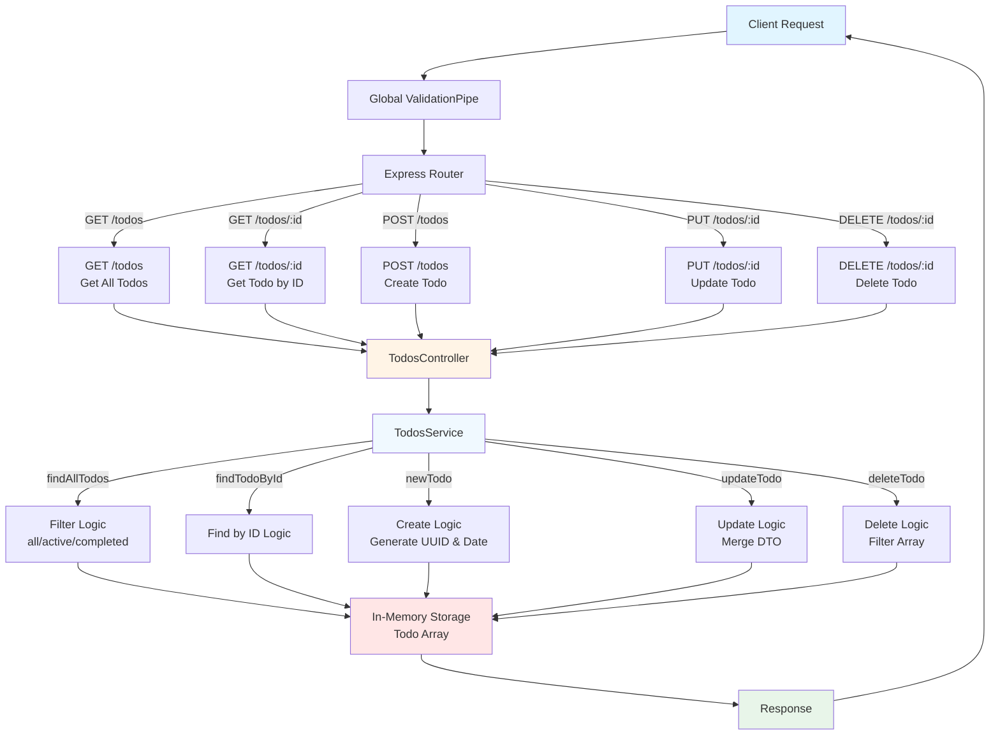

# Todo App API

A RESTful API for managing todos built with NestJS. This API provides CRUD operations for todo items with filtering capabilities and Swagger documentation.

## 🚀 Technology Stack

### Core Framework
- **NestJS** (v11.0.1) - Progressive Node.js framework for building efficient and scalable server-side applications
- **TypeScript** (v5.7.3) - Typed superset of JavaScript
- **Express** (via @nestjs/platform-express) - Web framework

### Key Libraries
- **@nestjs/swagger** (v11.2.3) - API documentation with Swagger/OpenAPI
- **class-validator** (v0.14.3) - Validation decorators for DTOs
- **class-transformer** (v0.5.1) - Object transformation utilities
- **RxJS** (v7.8.1) - Reactive programming library

### Development Tools
- **Biome** (v2.3.8) - Fast formatter and linter
- **Jest** (v30.0.0) - Testing framework
- **TypeScript ESLint** - TypeScript linting

## 📋 Features

- ✅ Create, read, update, and delete todos
- 🔍 Filter todos by status (all, active, completed)
- 📝 Input validation using class-validator
- 📚 Swagger/OpenAPI documentation
- 🏗️ Modular architecture with NestJS modules
- 🧪 Test infrastructure with Jest

## 🛠️ Installation

```bash
# Install dependencies
npm install

# Start development server
npm run start:dev

# Build for production
npm run build

# Start production server
npm run start:prod
```

## 📖 API Documentation

Once the server is running, access the Swagger documentation at:
- **URL**: `http://localhost:3000/docs`

## 🔌 API Routes

### Todos Endpoints

| Method | Route | Description | Query Params |
|--------|-------|-------------|--------------|
| `GET` | `/todos` | Get all todos | `filter` (optional): `'all' \| 'active' \| 'completed'` |
| `GET` | `/todos/:id` | Get a todo by ID | - |
| `POST` | `/todos` | Create a new todo | - |
| `PUT` | `/todos/:id` | Update a todo | - |
| `DELETE` | `/todos/:id` | Delete a todo | - |

### Request/Response Examples

#### Create Todo
```http
POST /todos
Content-Type: application/json

{
  "title": "Complete the project"
}
```

#### Update Todo
```http
PUT /todos/:id
Content-Type: application/json

{
  "title": "Updated title",
  "completed": true
}
```

#### Get All Todos (with filter)
```http
GET /todos?filter=active
```

## 📊 Application Flow & Architecture



## 🏗️ Project Structure

```
src/
├── app.module.ts          # Root application module
├── main.ts                # Application entry point
├── common/
│   └── interfaces/
│       └── todo.model.ts  # Todo interface and Filter type
└── todos/
    ├── todos.module.ts    # Todos feature module
    ├── todos.controller.ts # Todos HTTP handlers
    ├── todos.service.ts   # Todos business logic
    └── dto/
        ├── create-todo.dto.ts      # Create todo DTO
        ├── update-todo.dto.ts      # Update todo DTO
        └── todos-response.dto.ts   # Response DTO
```

## 🔧 Available Scripts

- `npm run build` - Build the application
- `npm run format` - Format code with Prettier
- `npm run start` - Start the application
- `npm run start:dev` - Start in development mode (watch mode)
- `npm run start:debug` - Start in debug mode
- `npm run start:prod` - Start production server
- `npm run lint` - Run ESLint
- `npm run test` - Run unit tests
- `npm run test:watch` - Run tests in watch mode
- `npm run test:cov` - Run tests with coverage
- `npm run test:e2e` - Run end-to-end tests

## 📝 Data Model

### Todo Interface
```typescript
interface Todo {
  id: string          // UUID
  title: string       // Todo title
  completed: boolean  // Completion status
  createdAt: Date     // Creation timestamp
}
```

### Filter Type
```typescript
type Filter = 'all' | 'active' | 'completed'
```

## 🔒 Validation

- **CreateTodoDto**: Requires `title` (string, min length 1)
- **UpdateTodoDto**: Optional `title` (string, min length 1) and `completed` (boolean)

All validation is handled automatically by the global `ValidationPipe`.

## 🌐 Default Configuration

- **Port**: 3000 (configurable via `PORT` environment variable)
- **Documentation**: `/docs`

## 📄 License

UNLICENSED
